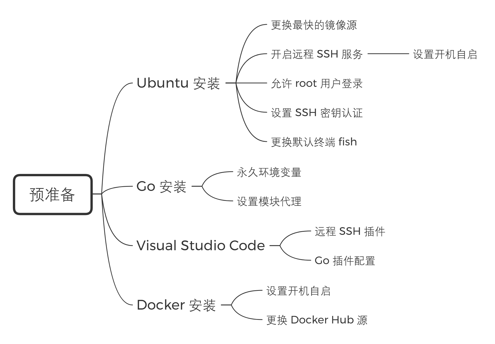

# Docker 学习笔记

> 参考了 Docker 官方最新英文文档（v19.03）以及多本从入门到“放弃”的 Docker 教程书

自学最怕的大概就是找不到学习的动力和乐趣，直白一点就是眼前的利益，我终究也还是目光短浅的普通人。

从毕业论文开题报告结束至今，我粗粗地看完了大概四五本 Docker 入门到“放弃”的教程书，但也还仅仅是略懂皮毛而已。

Docker 作为一直在发展的新技术，那些书不少地方已经是过去式了。再者只是学几个执行命令似乎也不是我所追求的，我最终的目标是浅尝其实现的源码，而在这之前，我的最后一个目标是读完官方最新的英文文档（v19.03）。

为了不至于枯燥，我计划以公众号文章的方式写此系列的学习笔记，既丰富了个人微信公众号的内容，同时也是对此前所学的复习与总结，加深对知识的印象和理解。

最后说明一点，**该系列文章不是为 Docker 入门而写的教程，只是我个人的学习笔记**，因此一些基础知识我不会去多加解释。

## 开始前预准备

```bash
$ cat /etc/issue
Ubuntu 18.04.3 LTS \n \l
```

```bash
$ go version
go version go1.13.4 linux/amd64
```

```bash
$ docker version
Client: Docker Engine - Community
 Version:           19.03.5
 API version:       1.40
 Go version:        go1.12.12
 Git commit:        633a0ea838
 Built:             Wed Nov 13 07:29:52 2019
 OS/Arch:           linux/amd64
 Experimental:      false

Server: Docker Engine - Community
 Engine:
  Version:          19.03.5
  API version:      1.40 (minimum version 1.12)
  Go version:       go1.12.12
  Git commit:       633a0ea838
  Built:            Wed Nov 13 07:28:22 2019
  OS/Arch:          linux/amd64
  Experimental:     false
 containerd:
  Version:          1.2.10
  GitCommit:        b34a5c8af56e510852c35414db4c1f4fa6172339
 runc:
  Version:          1.0.0-rc8+dev
  GitCommit:        3e425f80a8c931f88e6d94a8c831b9d5aa481657
 docker-init:
  Version:          0.18.0
  GitCommit:        fec3683
```

相信这部分配置并不困难，我暂时也不打算撰写详细的教程，仅列出一个最适合我的过程框架图。



## 目录章节

* 引言
    * [开始前预准备](#开始前预准备)
    * [目录章节](#目录章节)
* 原理
    * [命名空间](原理/命名空间/命名空间概述.md)
        * [UTS 命名空间](原理/命名空间/UTS%20命名空间.md)
        * [IPC 命名空间](原理/命名空间/IPC%20命名空间.md)
        * [PID 命名空间](原理/命名空间/PID%20命名空间.md)
        * [Mount 命名空间](原理/命名空间/Mount%20命名空间.md)
        * [User 命名空间](原理/命名空间/User%20命名空间.md)
        * [Network 命名空间](原理/命名空间/Network%20命名空间.md)
        * [Cgroup 命名空间](原理/命名空间/Cgroup%20命名空间.md)
        * [自制一个简易容器](原理/命名空间/自制一个简易容器.md)
    * [控制组](原理/控制组/控制组概述.md)
        * [操作控制组树](原理/控制组/操作控制组树.md)
        * [操作进程子系统](原理/控制组/操作进程子系统.md)
        * [操作 CPU 子系统](原理/控制组/操作%20CPU%20子系统.md)
        * [操作内存子系统](原理/控制组/操作内存子系统.md)

更新中……