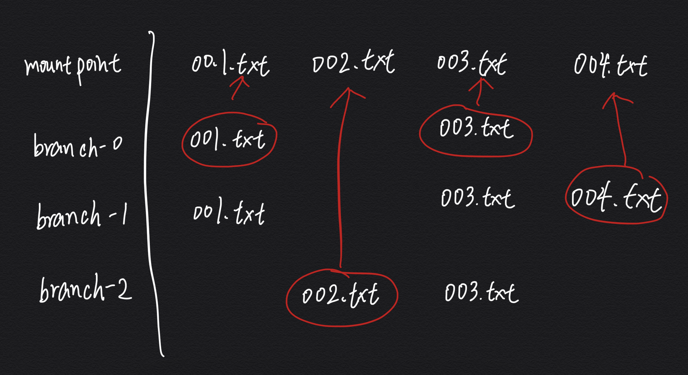

# AUFS 简介

> 全称 Advanced Multi-Layered Unification Filesystem，以前是 Docker 默认的存储驱动类型，尽管现在已经被 Overlay2 全面取代，我认为还是有必要了解一下。

## 确认系统是否支持 AUFS

```bash
$ grep aufs /proc/filesystems
nodev   aufs
```

> `nodev` 表示该文件系统无需建立在物理/虚拟设备上，而是以其他文件系统为基础。

## AUFS 挂载命令

```bash
$ mount -t aufs -o br=branch-0:branch-1:branch-2 none mountpoint
# br 也可以用 dirs 替代
```

- `-t aufs`： 指定挂载类型为 AUFS；
- `-o br=branch-0:branch-1:branch-2`： 表示将当前目录下的 `branch-0`，`branch-1`，`branch-2` 三个文件夹联合到一起；
- `none`：AUFS 不需要具体设备，只依赖于 `-o br` 指定的文件夹，所以这里填 `none` 即可；
- `mountpoint`：表示将最后联合的结果挂载到当前的 `mountpoint` 目录下，然后就可以往这个目录里面读写文件了。

**假设**： `branch-0` 里面有文件 001.txt、003.txt，`branch-1` 里面有文件 001.txt、003.txt、004.txt，`branch-2` 里面有文件 002.txt、003.txt。

则得到的**挂载点视图**为：



- 一个分支（branch）就是一个目录。
- 分支是有索引的，索引越小的分支会放在最上面，读取文件时访问的是最上层的文件。
- 可以指定每个分支的读写权限，默认第一个目录可写，其它目录只读。
- 访问一个文件时需要一级一级往下找，联合的目录（层级）过多会影响性能。

## 操作示例

### 只读挂载

1. 创建实验所需文件及文件夹

```bash
$ mkdir aufs && cd aufs && mkdir mnt image-layer1 image-layer2 && echo "I am image layer1" > image-layer1/image-layer1.txt && echo "I am image layer2" > image-layer2/image-layer2.txt && echo "I am image layer1" > image-layer1/image-layer.txt && echo "I am image layer2" > image-layer2/image-layer.txt

# 最终的目录结构
$ tree
.
├── image-layer1
│   ├── image-layer1.txt
│   └── image-layer.txt
├── image-layer2
│   ├── image-layer2.txt
│   └── image-layer.txt
└── mnt
```

2. 通过指定 `ro` 参数来让两个分支都为只读

```bash
# 将 image-layer2、image-layer1 以只读方式挂载到 mnt 目录
$ mount -t aufs -o br=image-layer2=ro:image-layer1=ro none mnt
$ ls mnt/
image-layer1.txt  image-layer2.txt  image-layer.txt

$ cat mnt/image-layer.txt
I am image layer2
```

3. 尝试写入文件

```bash
$ echo aufs > mnt/README.md
An error occurred while redirecting file 'mnt/README.md'
open: Read-only file system
```

4. 尝试跳过 `mnt/` 读写源目录

```bash
$ echo aufs > image-layer1/README.md
# 是可以的

# 但在挂载点下看有些问题
$ ls mnt/
ls: cannot access 'mnt/README.md': No such file or directory
image-layer.txt  README.md

# 卸载
$ umount mnt

$ rm image-layer1/README.md
```

### 读写挂载

如果联合的文件夹有写的权限，那么所有的修改都会写入可写的那个文件夹；如果可写的文件夹有多个，那么写入哪个文件夹就依赖于相应的策略（这种情况不讨论）。

1. 一个文件夹读写挂载，另一个只读挂载
```bash
# image-layer2 可读写、image-layer1 只读
$ mount -t aufs -o br=image-layer2:image-layer1=ro none mnt
```

2. 尝试写入文件

```bash
$ echo "mnt -> w" >> mnt/image-layer1.txt
$ echo "mnt -> w" >> mnt/image-layer2.txt
$ echo "mnt -> w" >> mnt/image-layer.txt
$ echo "mnt -> w" >> mnt/README.md

$ ls mnt/
image-layer1.txt  image-layer2.txt  image-layer.txt  README.md
```

3. 检查源文件

```bash
$ cat image-layer1/image-layer1.txt
I am image layer1

$ cat image-layer2/image-layer2.txt
I am image layer2
mnt -> w

$ tree
.
├── image-layer1
│   ├── image-layer1.txt
│   └── image-layer.txt
├── image-layer2
│   ├── image-layer1.txt
│   ├── image-layer2.txt
│   ├── image-layer.txt
│   └── README.md
└── mnt
    ├── image-layer1.txt
    ├── image-layer2.txt
    ├── image-layer.txt
    └── README.md
```

- 修改一个具有读写权限目录下的文件时，直接修改该文件；
- 当修改一个只读权限目录下的文件时，AUFS 会先将该文件拷贝到一个有读写权限的目录里面，然后在上面进行修改，这就是写时复制，拷贝的速度依赖于底层分支所在的文件系统。

### 删除文件

删除文件时，如果该文件只在读写目录下有，那就直接删除读写目录下的该文件，如果该文件在只读目录下有，那么 AUFS 将会在读写目录里面创建一个 `.wh` 开头的文件，标识该文件已被删除。

```bash
$ rm mnt/*
$ tree
.
├── image-layer1
│   ├── image-layer1.txt
│   └── image-layer.txt
├── image-layer2
└── mnt

$ ls -a image-layer2 -a
./  ../  .wh.image-layer1.txt  .wh.image-layer.txt  .wh..wh.aufs  .wh..wh.orph/  .wh..wh.plnk/

$ umount mnt
```

> **最后建议**：将所有的目录都以只读的方式和一个支持读写的空目录联合起来，这样所有的修改都会存到那个指定的空目录中，不用之后删除掉那个目录就可以了。

### 章节导航

- 上一节：[联合文件系统概述](联合文件系统概述.md)
- 下一节：[OverlayFS 简介](OverlayFS.md)
