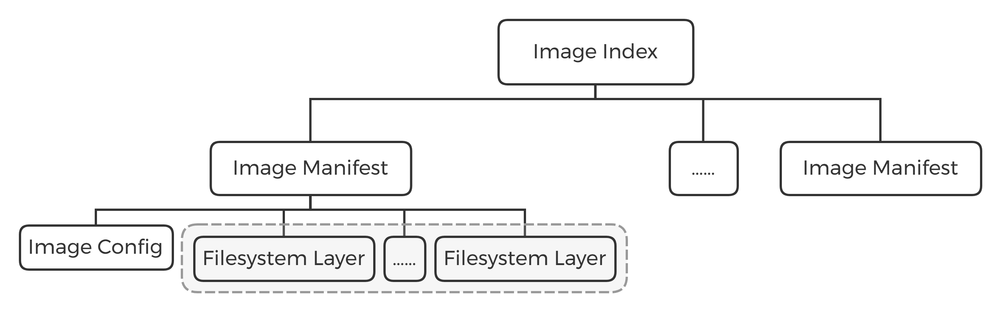

# 浅析 Image 标准

> [Image](https://github.com/opencontainers/image-spec) 标准由 Open Container Initiative（OCI）负责定义维护。

## 组成部分关系图

一个 Image 由 [Manifest](https://github.com/opencontainers/image-spec/blob/master/manifest.md)、[Image Index (Optional)](https://github.com/opencontainers/image-spec/blob/master/image-index.md)、[Layers](https://github.com/opencontainers/image-spec/blob/master/layer.md) 和 [Config](https://github.com/opencontainers/image-spec/blob/master/config.md) 四部分组成。



- Image Index 和 Manifest 可以是**一对多**的关系；
- Image Manifest 和 Config 是**一对一**的关系；
- Image Manifest 和 Filesystem Layer 可以是**一对多**的关系。

## Filesystem Layer

Filesystem Layer 包含了文件系统的信息，即该 Image 包含了哪些文件/目录，以及它们的属性和数据。

每一层 layer 都包含了在上一层 layer 上的改动情况，比如在某一层增加了一个文件，那么这一层所包含的内容就是增加的这个文件的数据以及它的属性，改动信息大致包含三方面的内容：

- **变化类型**：是增加、修改还是删除了文件。
- **文件类型**：每个变化发生在哪种文件类型上。
- **文件属性**：文件的修改时间、User ID、Group ID、RWX 权限等。

**Layer 打包格式**

最终每层 layer 都会被打包成一个压缩文件，压缩格式可以是 `tar` 或 `tar+gzip` 。

对于这两种不同类型的文件格式，Image 标准定义了两个新的 `media types`，分别是 `application/vnd.oci.image.layer.v1.tar` 和 `application/vnd.oci.image.layer.v1.tar+gzip`。

同时标准还定义了 `application/vnd.oci.image.layer.nondistributable.v1.tar` 和 `application/vnd.oci.image.layer.nondistributable.v1.tar+gzip` 这两种对应于 `nondistributable` 的格式，其实这两种格式和前两种格式包含的内容是一样的，只是用不同的类型名称来区分它们的用途，对于名称中有 `nondistributable` 的 layer，标准规定只能下载不能上传。

## Image Config

Config 就是一个 json 文件，它的 `media type` 是 `application/vnd.oci.image.config.v1+json`，这个 json 文件包含了对这个 image 的描述信息。比如以相对简单的 “hello-world” 为例：

```json
{
    "architecture": "amd64",
    "config": {
        "Hostname": "",
        "Domainname": "",
        "User": "",
        "AttachStdin": false,
        "AttachStdout": false,
        "AttachStderr": false,
        "Tty": false,
        "OpenStdin": false,
        "StdinOnce": false,
        "Env": [
            "PATH=/usr/local/sbin:/usr/local/bin:/usr/sbin:/usr/bin:/sbin:/bin"
        ],
        "Cmd": [
            "/hello"
        ],
        "ArgsEscaped": true,
        "Image": "sha256:a6d1aaad8ca65655449a26146699fe9d61240071f6992975be7e720f1cd42440",
        "Volumes": null,
        "WorkingDir": "",
        "Entrypoint": null,
        "OnBuild": null,
        "Labels": null
    },
    "container": "8e2caa5a514bb6d8b4f2a2553e9067498d261a0fd83a96aeaaf303943dff6ff9",
    "container_config": {
        "Hostname": "8e2caa5a514b",
        "Domainname": "",
        "User": "",
        "AttachStdin": false,
        "AttachStdout": false,
        "AttachStderr": false,
        "Tty": false,
        "OpenStdin": false,
        "StdinOnce": false,
        "Env": [
            "PATH=/usr/local/sbin:/usr/local/bin:/usr/sbin:/usr/bin:/sbin:/bin"
        ],
        "Cmd": [
            "/bin/sh",
            "-c",
            "#(nop) ",
            "CMD [\"/hello\"]"
        ],
        "ArgsEscaped": true,
        "Image": "sha256:a6d1aaad8ca65655449a26146699fe9d61240071f6992975be7e720f1cd42440",
        "Volumes": null,
        "WorkingDir": "",
        "Entrypoint": null,
        "OnBuild": null,
        "Labels": {}
    },
    "created": "2019-01-01T01:29:27.650294696Z",
    "docker_version": "18.06.1-ce",
    "history": [
        {
            "created": "2019-01-01T01:29:27.416803627Z",
            "created_by": "/bin/sh -c #(nop) COPY file:f77490f70ce51da25bd21bfc30cb5e1a24b2b65eb37d4af0c327ddc24f0986a6 in / "
        },
        {
            "created": "2019-01-01T01:29:27.650294696Z",
            "created_by": "/bin/sh -c #(nop)  CMD [\"/hello\"]",
            "empty_layer": true
        }
    ],
    "os": "linux",
    "rootfs": {
        "type": "layers",
        "diff_ids": [
            "sha256:af0b15c8625bb1938f1d7b17081031f649fd14e6b233688eea3c5483994a66a3"
        ]
    }
}
```

只介绍几个属性：

- **config**：运行容器时的默认参数。
- **rootfs**：指定了 image 所包含全部的 filesystem layer，其中 `type` 的值必须是 `layers`，`diff_ids` 是一个包含了所有 layer 的列表，严格按顺序排列，从上到下依次是从底层到顶层，每一个 sha256 就是每层 layer 打包之后的压缩文件的 sha256 码。

## Manifest

Manifest 也是一个 json 文件，`media type` 为 `application/vnd.oci.image.manifest.v1+json`，这个文件包含了对前面 filesystem layers 和 image config 的描述。

**[官方示例](https://github.com/opencontainers/image-spec/blob/master/manifest.md)**：

```json
{
  "schemaVersion": 2,
  "config": {
    "mediaType": "application/vnd.oci.image.config.v1+json",
    "size": 7023,
    "digest": "sha256:b5b2b2c507a0944348e0303114d8d93aaaa081732b86451d9bce1f432a537bc7"
  },
  "layers": [
    {
      "mediaType": "application/vnd.oci.image.layer.v1.tar+gzip",
      "size": 32654,
      "digest": "sha256:9834876dcfb05cb167a5c24953eba58c4ac89b1adf57f28f2f9d09af107ee8f0"
    },
    {
      "mediaType": "application/vnd.oci.image.layer.v1.tar+gzip",
      "size": 16724,
      "digest": "sha256:3c3a4604a545cdc127456d94e421cd355bca5b528f4a9c1905b15da2eb4a4c6b"
    },
    {
      "mediaType": "application/vnd.oci.image.layer.v1.tar+gzip",
      "size": 73109,
      "digest": "sha256:ec4b8955958665577945c89419d1af06b5f7636b4ac3da7f12184802ad867736"
    }
  ],
  "annotations": {
    "com.example.key1": "value1",
    "com.example.key2": "value2"
  }
}
```

- **config** 的 digest（sha256）就是 Manifest 文件的 ID，也即 image config 文件的 sha256 值。
- **layers** 包含了对每一个 layer 的基本描述。

## Image Index (Optional)

Image Index 也是个 json 文件，`media type` 是 `application/vnd.oci.image.index.v1+json`。引入这个文件是因为 manifest 描述的 image 只能支持一个平台。加上 index 文件就可以让这个 image 支持多个平台。

**[官方示例](https://github.com/opencontainers/image-spec/blob/master/image-index.md)**：

```json
{
  "schemaVersion": 2,
  "manifests": [
    {
      "mediaType": "application/vnd.oci.image.manifest.v1+json",
      "size": 7143,
      "digest": "sha256:e692418e4cbaf90ca69d05a66403747baa33ee08806650b51fab815ad7fc331f",
      "platform": {
        "architecture": "ppc64le",
        "os": "linux"
      }
    },
    {
      "mediaType": "application/vnd.oci.image.manifest.v1+json",
      "size": 7682,
      "digest": "sha256:5b0bcabd1ed22e9fb1310cf6c2dec7cdef19f0ad69efa1f392e94a4333501270",
      "platform": {
        "architecture": "amd64",
        "os": "linux"
      }
    }
  ],
  "annotations": {
    "com.example.key1": "value1",
    "com.example.key2": "value2"
  }
}
```

Index 文件包含了对 image 中所有 manifest 的描述，相当于一个 manifest 列表，包括每个 manifest 的 `media type`、文件大小、sha256 码、支持的平台以及平台特殊的配置等信息。

## Image Layout

[Image Layout](https://github.com/opencontainers/image-spec/blob/master/image-layout.md) 是一个可以根据内容寻址和位置寻址的**文件名称和目录结构参考标准**，方便在不同机器、容器平台之间导入导出。

由于 Docker 无法导出 OCI 格式的镜像，为了了解 Image 的目录结构，必须借助其他工具得到 OCI 格式的镜像文件，这里采用 [skopeo](https://github.com/projectatomic/skopeo) 演示。

1. 安装依赖

```bash
$ apt install pkg-config libgpgme-dev libassuan-dev libbtrfs-dev libdevmapper-dev
```

2. 下载编译

```bash
$ git clone https://gitee.com/fujiawei/skopeo.git
$ cd skopeo
$ make binary-local && make install
```

3. 获取镜像

```bash
$ skopeo copy docker://hello-world oci:hello-world
```

4. 目录结构

```bash
$ tree hello-world/
hello-world/
├── blobs
│   └── sha256
│       ├── 1b930d010525941c1d56ec53b97bd057a67ae1865eebf042686d2a2d18271ced
│       ├── 51214b9592e74acb2d0cf345fcb571005a94d4c8031553ee3c3e11a128228f29
│       └── a1c2dc0436ebd2a8c85aac010c5002b907780ef21c921e67bf68052e316bdbd5
├── index.json
└── oci-layout
```

### oci-layout 文件

记录了 Image 标准的版本信息。

```bash
$ cat oci-layout | python -mjson.tool
{
    "imageLayoutVersion": "1.0.0"
}
```

### index.json 文件

这个文件作为 image-layout 的入口点是必须存在的。

```bash
$ cat index.json | python -mjson.tool
{
    "manifests": [
        {
            "digest": "sha256:51214b9592e74acb2d0cf345fcb571005a94d4c8031553ee3c3e11a128228f29",
            "mediaType": "application/vnd.oci.image.manifest.v1+json",
            "size": 344
        }
    ],
    "schemaVersion": 2
}
```

### blobs/sha256 文件夹

该文件夹下包含了具体文件的内容，每个文件名都是其内容的 sha256 码，根据上面 index.json 文件里面的 sha256，就能在这里找到对应的 manifest 文件的内容，然后根据 manifest 文件的内容，就能一步一步的往下找到 image config 文件和 filesystem layers 文件。

```bash
$ cat blobs/sha256/51214b9592e74acb2d0cf345fcb571005a94d4c8031553ee3c3e11a128228f29 | python -mjson.tool
{
    "config": {
        "digest": "sha256:a1c2dc0436ebd2a8c85aac010c5002b907780ef21c921e67bf68052e316bdbd5",
        "mediaType": "application/vnd.oci.image.config.v1+json",
        "size": 584
    },
    "layers": [
        {
            "digest": "sha256:1b930d010525941c1d56ec53b97bd057a67ae1865eebf042686d2a2d18271ced",
            "mediaType": "application/vnd.oci.image.layer.v1.tar+gzip",
            "size": 977
        }
    ],
    "schemaVersion": 2
}
```

### 章节导航

- 上一节：[浅析 RUN 执行过程](run.md)
- 下一节：[通过 runc 运行容器](runc.md)
