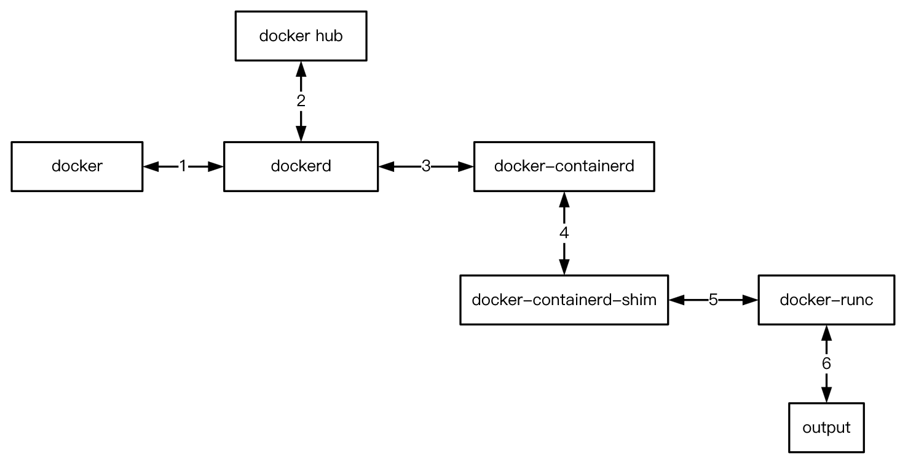

# 浅析 RUN 执行过程

- [浅析 RUN 执行过程](#浅析-run-执行过程)
  - [一个 RUN 实例](#一个-run-实例)
  - [图中步骤详解](#图中步骤详解)
    - [docker ↔ dockerd](#docker--dockerd)
    - [dockerd ↔ docker hub](#dockerd--docker-hub)
    - [dockerd ↔ docker-containerd](#dockerd--docker-containerd)
    - [docker-containerd ↔ docker-containerd-shim](#docker-containerd--docker-containerd-shim)
    - [docker-containerd-shim ↔ docker-runc](#docker-containerd-shim--docker-runc)
    - [docker-runc ↔ output](#docker-runc--output)
  - [进程间的关系](#进程间的关系)
  - [详细步骤模拟](#详细步骤模拟)
    - [章节导航](#章节导航)

## 一个 RUN 实例

```bash
$ docker run hello-world

Hello from Docker!
This message shows that your installation appears to be working correctly.

To generate this message, Docker took the following steps:
 1. The Docker client contacted the Docker daemon.
 2. The Docker daemon pulled the "hello-world" image from the Docker Hub. (amd64)
 3. The Docker daemon created a new container from that image which runs the executable that produces the output you are currently reading.
 4. The Docker daemon streamed that output to the Docker client, which sent it to your terminal.
   ……
```

这个容器运行的时候就是打印上面一段话到终端，然后自行退出。在输出结果中，Docker 向我们描述了 RUN 执行的大概步骤：

1. Docker 客户端尝试连接 Docker 守护进程（服务器端）；
2. Docker 守护进程从 Docker Hub 拉取 "hello-world" 镜像文件；
3. Docker 守护进程基于这个镜像文件创建一个新的容器，这个镜像的初始运行程序会生成这段话；然后 Docker 守护进程启动这个容器；
3. Docker 守护进程将该输出流式传输到 Docker 客户端，客户端将这段文字发送到终端。

实际上，更详细的**进程之间的关系图**是这样的：



## 图中步骤详解

### docker ↔ dockerd

docker 进程就是 docker 客户端，dockerd 进程就是 docker 服务器端（守护进程）。run 命令最开始启动的是 docker 客户端，它的任务是解析命令行参数，然后构造 RESTful 启动容器请求，通过 HTTP 发送到 docker 服务端，docker 服务端返回结果数据。

[Engine API](https://docs.docker.com/engine/api/latest/) 里描述了dockerd 支持的所有请求，当前最新版本为 [v1.40](https://docs.docker.com/engine/api/v1.40/)，不同版本之间的差别可以参考 [version history](https://docs.docker.com/engine/api/version-history/)。

### dockerd ↔ docker hub

当 dockerd 收到客户端的运行容器请求后，发现本地没有相应的镜像，就会从 Docker Hub 拉取相应的镜像。两者之间也是通过 RESTful HTTP 通信，协议为 [Registry HTTP API V2](https://docs.docker.com/registry/spec/api/)。

**拉取镜像的大概过程**：

1. 获取 image 的 manifests，manifests 包含两部分内容，一是 image 配置文件的 digest，二是 image 包含的所有 filesystem layer 的 digest；
2. 根据上一步得到的 image 配置文件的 digest，在本地查找是否已经存在对应的 image，已经存在就用现成的，不存在则继续三、四步骤；
3. 遍历 manifests 里面的所有 layer，根据其 digest 在本地查找，如果找到对应的 layer，则跳过当前 layer，否则从服务器拉取相应 layer 的压缩包；
4. 拼出完整的 image。

这里的每个 layer 都是相对于上一个文件系统 layer 的变化情况。

### dockerd ↔ docker-containerd

dockerd 获得 image 后，就会在本地创建相应的容器，然后做一些初始化工作，最后通过 grpc 协议通知 docker-containerd 进程启动指定的容器。

docker-containerd 是和 dockerd 一起启动的后台进程，它们之间使用 unix socket 通信，协议是 grpc。

### docker-containerd ↔ docker-containerd-shim

docker-containerd 与 docker-containerd-shim 都属于 [containerd](https://github.com/containerd/containerd) 项目，当 docker-containerd 收到 dockerd 的启动容器请求之后，会做一些初始化工作，然后启动 docker-containerd-shim 进程，并将相关配置所在的目录作为参数传给它。

可以简单地理解成 docker-containerd 管理所有本机正在运行的容器，而 docker-containerd-shim 只负责管理一个运行的容器，相当于是对 runc 的一个包装，作为 containerd 和 runc 之间的桥梁。

### docker-containerd-shim ↔ docker-runc

docker-containerd-shim 进程启动后，按照 runtime 的标准准备好 rootfs 和配置文件（相关运行时环境），然后用合适的参数启动 docker-runc 进程。

[Image](https://github.com/opencontainers/image-spec) 和 [runtime](https://github.com/opencontainers/runtime-spec) 标准都由 Open Container Initiative（OCI）负责定义维护，[runc](https://github.com/opencontainers/runc) 是 docker 贡献给 OCI 的一个标准 runtime 实现。

### docker-runc ↔ output

runc 进程打开容器的配置文件，找到 rootfs 的位置，并启动配置文件中指定的程序进程。到此为止，容器启动成功。

## 进程间的关系

runc 将容器启动起来后，runc 进程就退出了，于是容器里面的第一个进程（hello-world）的父进程就变成了 docker-containerd-shim（可以指定孤儿进程被谁接管），在 pstree 的输出里面，进程树的关系大概如下（实际操作过程中看不到这样的输出）：

```
systemd───dockerd
        ├─containerd───containerd-shim───hello-world
        └─sshd───bash───docker
```

其中 dockerd 和 docker-containerd 是后台常驻进程，而 docker-containerd-shim 则由 docker-containerd 按需启动。

## 详细步骤模拟

> 提前是已经将 Docker 守护进程绑定到 HTTP 协议上，监听端口号 5678。

0. 删除之前的镜像

```bash
$ docker rmi -f hello-world
```

1. 向 dockerd 请求创建容器

```bash
$ curl '127.0.0.1:5678/v1.40/containers/create'  -X POST -H "Content-Type: application/json" -d '{"Image": "hello-world"}'

{"message":"No such image: hello-world:latest"}

# 创建失败，本地不存在该镜像
```

2. 请求 dockerd 从 registry 服务器拉取 image

```bash
$ curl '127.0.0.1:5678/v1.40/images/create?fromImage=hello-world&tag=latest' -X POST

{"status":"Pulling from library/hello-world","id":"latest"}
{"status":"Image docker.io/library/hello-world:latest uses outdated schema1 manifest format. Please upgrade to a schema2 image for better future compatibility. More information at https://docs.docker.com/registry/spec/deprecated-schema-v1/"}
{"status":"Already exists","progressDetail":{},"id":"1b930d010525"}
{"status":"Digest: sha256:fb158b7ad66f4d58aa66c4455858230cd2eab4cdf29b13e5c3628a6bfc2e9f05"}
{"status":"Status: Downloaded newer image for hello-world:latest"}

# 拉取成功
```

3. 再次向 dockerd 请求创建容器

```bash
$ curl '127.0.0.1:5678/v1.40/containers/create'  -X POST -H "Content-Type: application/json" -d '{"Image": "hello-world"}'

{"Id":"ea2659c74b6177968afd00185361e3c7942bb5be8b56fa3e3eccc0ec31bc5d4a","Warnings":[]}

# 创建成功
```

4. 容器标准输入输出重定向

```bash
$ curl '127.0.0.1:5678/v1.40/containers/ea2659c74b6177968afd00185361e3c7942bb5be8b56fa3e3eccc0ec31bc5d4a/attach?stderr=1&stdout=1&stream=1' -d '{"Connection": "Upgrade", "Upgrade":"tcp"}'

# 程序会暂停在这里，等待容器的输出
```

5. 另外打开一个终端，启动容器

```bash
$ curl 127.0.0.1:5678/v1.40/containers/ea2659c74b6177968afd00185361e3c7942bb5be8b56fa3e3eccc0ec31bc5d4a/start -X POST
```

切换回之前的终端，理论上可以看到与笔记开头一模一样的输出，但实际上我只看到了一个警告，我当时未深究原因。

### 章节导航

- 上一节：[OverlayFS 简介](../原理/联合文件系统/OverlayFS.md)
- 下一节：[浅析 Image 标准](image.md)
